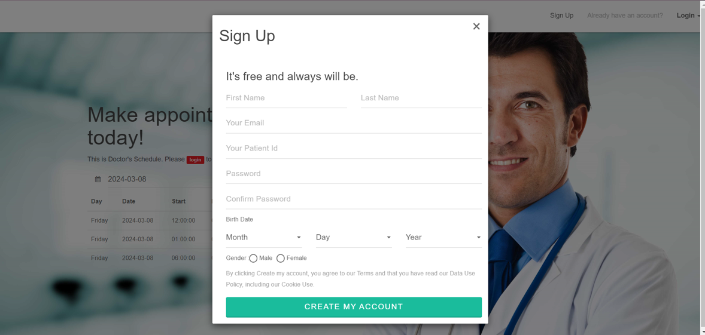
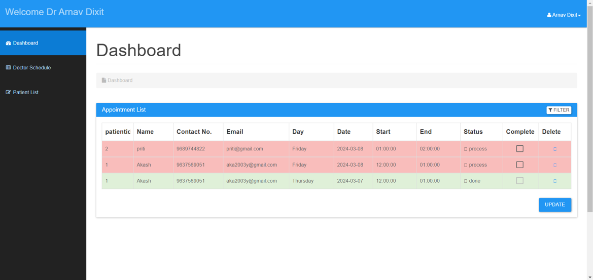
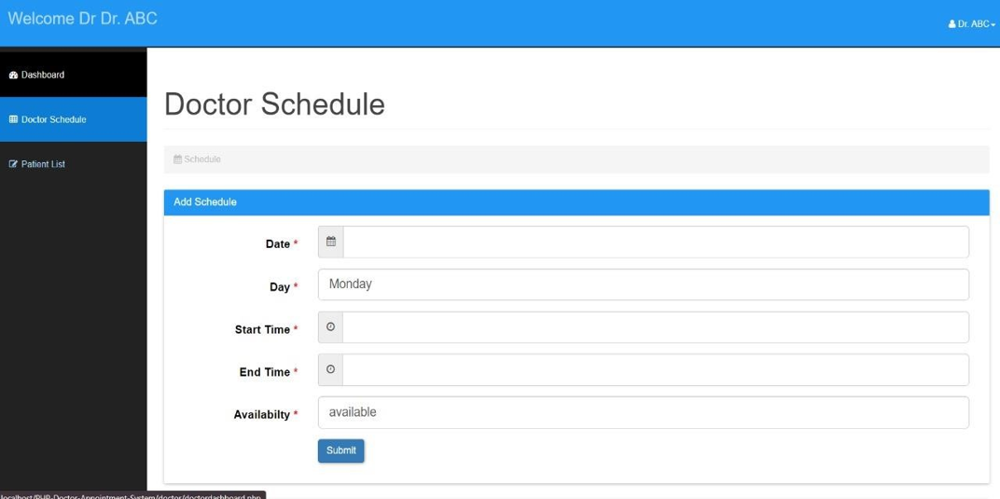

# PHP-Doctor-Appointment-System

## Description
“Doctor Appointment Management System” is responsible for keeping all the records of doctor appointments that are taken by users. This system helps the patient take an appointment online and save time. 
The main objective of the “Doctor Appointment Management System” project is to provide easier doctor appointment and gets appointment online which save lots of time.

## Features
- Doctor Schedules Appointment
- Patients can book Appointment
- Provide Symptoms to the Doctor
- User-friendly website

## Screenshots





## Technologies Used
- HTML
- CSS
- JavaScript
- PHP
- MySQL

## Installation
1. Clone the repository:
   ```bash
   cd PHP-Doctor-Appointment-System
   
   ```
2. Run Project
   ```bash
   Run project On any Browser that supports CSS & PHP
   Type localhost/PHP-Doctor-Appointment-System
   Another tab- http://localhost/phpmyadmin/index.php?route=/sql&db
   Add sql table in phpmyadmin
   ```
## Usage
1. Launch the application.
2. Follow the on-screen instructions to book Doctor's Appointment
